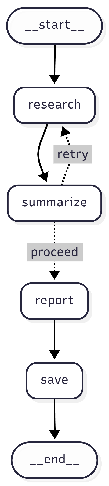

# Content Pipeline Agent

An automated research-to-report pipeline built with **LangGraph** and **Groq**. Give it a topic, and it researches the web, evaluates quality, and produces a structured markdown report — retrying if the research isn't good enough.

---

## What This Teaches

This project is a hands-on introduction to **workflow orchestration** — the same concepts behind enterprise tools like n8n, Prefect, and Temporal, implemented from scratch.

| Concept | What it means here |
|---|---|
| **Nodes** | Plain Python functions that read state and return updates |
| **Edges** | Rules for which node runs next |
| **Conditional edges** | Branches that route based on runtime state (the quality retry loop) |
| **Shared state** | A `TypedDict` every node reads from and writes to — the "memory" of the workflow |
| **Sink node** | The terminal node that writes output to the world (`save_node`) |
| **DAG** | The compiled graph — defined once, run many times |

---

## Workflow Graph

```
[START]
   │
   ▼
[Research Node] ◄─────────────────────────┐
   │                                       │
   ▼                                       │
[Summarize Node] ── quality < 6, retries left ──┘
   │
   │ quality >= 6  (or out of retries)
   ▼
[Report Node]
   │
   ▼
[Save Node]
   │
   ▼
[END]
```



---

## Project Structure

```
content-pipeline-agent/
├── agent.py        # Graph assembly, CLI entry point
├── nodes.py        # All node functions + routing function
├── state.py        # PipelineState TypedDict definition
├── tools.py        # web_search() — DuckDuckGo scraper
├── outputs/        # Generated reports saved here
├── assets/         # Static assets (graph visualization PNG)
├── .env            # GROQ_API_KEY — never commit this
├── requirements.txt
└── README.md
```

---

## Setup

**1. Create and activate a virtual environment:**
```bash
python -m venv .venv
.venv/Scripts/activate    # Windows
source .venv/bin/activate # macOS/Linux
```

**2. Install dependencies:**
```bash
pip install -r requirements.txt
```

**3. Configure your API key:**
```bash
cp .env.example .env
# Open .env and set GROQ_API_KEY=your_key_here
```
Get a free key at [console.groq.com/keys](https://console.groq.com/keys).

---

## Usage

**Run the pipeline on a topic:**
```bash
python agent.py "AI in healthcare"
python agent.py "climate change adaptation strategies"
python agent.py "quantum computing for finance"
```

**Print the Mermaid graph diagram:**
```bash
python agent.py --visualize
```
Paste the output into [mermaid.live](https://mermaid.live) to see your workflow rendered visually.

**Example CLI output:**
```
> Researching: AI in healthcare
  Found 5 results.
> Summarizing findings...
  Quality: 8/10
> Generating report...
> Report saved to outputs/ai_in_healthcare_report.md

Done. Quality: 8, Retries: 0
```

If the quality score is below 6, the pipeline retries with a refined query (up to 2 retries):
```
> Researching: narrow topic
  Found 5 results.
> Summarizing findings...
  Quality: 4/10
  Quality below threshold — retrying with refined query.
> Researching: broader rephrased query
  Found 5 results.
> Summarizing findings...
  Quality: 7/10
> Generating report...
```

Reports are saved as markdown files in `outputs/`, named after the topic.

---

## How It Works

### State (`state.py`)

Every node shares a single `PipelineState` dict. Nodes return only the fields they change — LangGraph merges the update back in.

```python
class PipelineState(TypedDict):
    topic: str              # the input
    research_results: list[str]
    summary: str
    quality_score: int      # drives the conditional edge
    report: str
    retry_count: int        # loop guard — max 2 retries
    refined_query: str      # model-proposed better query on low quality
```

### Nodes (`nodes.py`)

Each node is a plain function `(state) -> dict`:

- **`research_node`** — searches DuckDuckGo using `state["refined_query"]` if set, else `state["topic"]`
- **`summarize_node`** — calls Groq with JSON mode to get `summary`, `quality_score`, and `refined_query` in one call
- **`report_node`** — calls Groq again to format the summary into a structured markdown report
- **`save_node`** — writes `state["report"]` to `outputs/<slug>_report.md`

### Routing (`route_after_summary`)

The conditional edge evaluates after every summarize run:

```python
if quality_score >= 6:       → proceed to report
elif retry_count >= 3:       → proceed (forced — out of retries)
else:                        → retry (loop back to research)
```

### Graph assembly (`agent.py`)

```python
graph = StateGraph(PipelineState)
graph.add_node(...)          # register nodes
graph.set_entry_point(...)   # first node
graph.add_edge(...)          # unconditional transitions
graph.add_conditional_edges( # the retry branch
    "summarize", route_after_summary,
    {"retry": "research", "proceed": "report"}
)
app = graph.compile()        # freeze into a runnable DAG
```

---

## Stack

- **[LangGraph](https://github.com/langchain-ai/langgraph)** — graph-based workflow orchestration
- **[Groq](https://groq.com)** — fast LLM inference (llama-3.3-70b-versatile)
- **[DuckDuckGo HTML](https://html.duckduckgo.com/html/)** — free, no-key web search
- **Python 3.11+**

---

## Real-World Equivalents

| This project | Production equivalent |
|---|---|
| `StateGraph` nodes | Steps in n8n / Prefect tasks / Temporal activities |
| Conditional edges | If/else branches in workflow tools |
| Shared state dict | Message bus / workflow context object |
| `graph.compile()` | A deployed workflow / scheduled DAG |
| `save_node` | Webhook sink / database write / email delivery |
